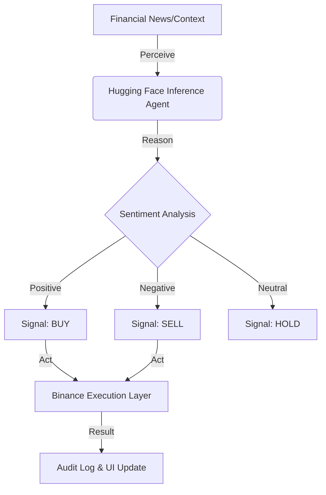
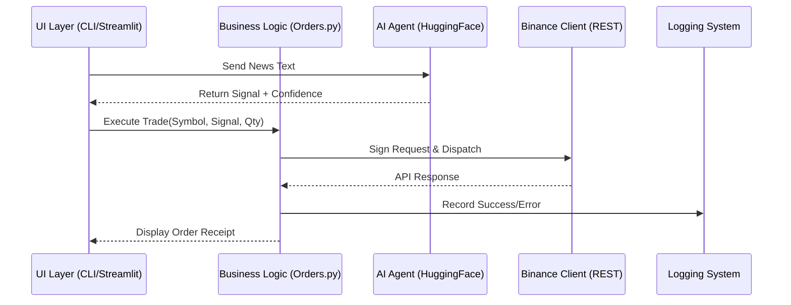

# 🚀 Advanced Binance Futures Trading Bot (Testnet)

[](https://www.python.org/downloads/)
[](https://opensource.org/licenses/MIT)
[](https://testnet.binancefuture.com)
[](https://huggingface.co/)
[](https://gyanprakash136-trading-agent-app-anotyp.streamlit.app/)

A robust, modular, and AI-enhanced Python application designed for high-precision trading on the **Binance Futures Testnet (USDT-M)**. This bot combines industrial-grade API integration with a modern CLI and cutting-edge sentiment analysis powered by Hugging Face.

**🔗 Live Demo**: [Explore the Agentic Dashboard](https://gyanprakash136-trading-agent-app-anotyp.streamlit.app/)

---

## ✨ Key Features

*   **🖥️ Dual-Interface Support**: Switch between a high-speed **CLI** and a professional **Streamlit Web Dashboard**.
*   **🧠 Agentic Decision Making**: An AI Agent layer that analyzes financial context (Hugging Face) to generate trading signals autonomously.
*   **⚡ High-Performance Trading**: Seamlessly place `MARKET` and `LIMIT` orders with millisecond-precision HMAC SHA256 request signing.
*   **🛡️ Enterprise Logging**: Comprehensive rotating file logs (`logs/trading_bot.log`) for full auditability.
*   **🧩 Modular Architecture**: Clean separation of concerns between API client, business logic, validation, and UI layers.

---

## 🤖 Agentic Architecture

The bot follows a **Perceive-Reason-Act** agentic loop, allowing it to move beyond static execution into informed decision-making.



---

## 🏗️ System Design

The system is designed with a layered architecture to ensure scalability and ease of testing.



---

## 📁 Project Structure

```text
binance_trading_bot/
├── bot/
│   ├── client.py           # Core Binance REST API client (HMAC Signing)
│   ├── huggingface_client.py # AI Sentiment Analysis Integration
│   ├── orders.py           # Order execution abstraction layer
│   ├── validators.py       # Strict input validation schemas
│   └── logging_config.py   # Centralized rotating logging system
├── logs/                   # System and Trade audit logs
├── app.py                  # Streamlit Web Dashboard
├── cli.py                  # CLI Entry point
├── requirements.txt        # Project dependencies
└── README.md               # Technical documentation
```

---

## 🚀 Getting Started

### 1. Installation

Clone the repository and initialize the virtual environment:

```bash
cd binance_trading_bot
python3 -m venv venv
source venv/bin/activate
pip install -r requirements.txt
```

### 2. Configuration

Create a `.env` file in the root directory:

```env
BINANCE_API_KEY=your_testnet_api_key
BINANCE_API_SECRET=your_testnet_api_secret
HUGGINGFACE_API_KEY=your_hf_token
```

---

## 💻 Usage

### A. Web Dashboard (Streamlit)
For a visual, interactive experience:
```bash
streamlit run app.py
```

### B. Command Line Interface (CLI)
For fast, manual execution:
```bash
python3 cli.py interactive
```

**Direct Command Examples:**
```bash
# Market Order
python3 cli.py trade BTCUSDT BUY MARKET 0.001

# AI-Assisted
python3 cli.py ai-trade BTCUSDT 0.001 "News Context Here"
```

---

## 🛡️ Enterprise Logging & Security

*   **Auditing**: All operations are recorded in `logs/trading_bot.log` using a `RotatingFileHandler`.
*   **Security**: API keys are handled strictly via environment variables. Request signing is done locally via HMAC-SHA256, ensuring secrets never leave your machine.

---

## ⚖️ Disclaimer

*This software is for educational purposes only. Trading involves risk. Use the Testnet for all testing.*
